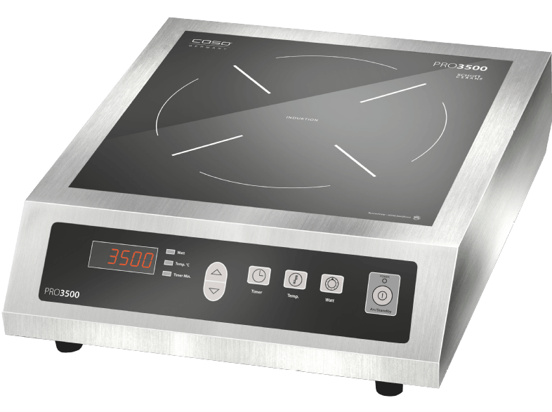

# CASO Pro 3500 RC Demo
_Demonstration on how to control your CASO Pro 3500 induction cooker remotely_

## Hardware Installation
_will be added soon_

## Software Requirements
* a RaspberryPi (Model B and higher)
* Python 3.4+ (Python 3.6 recommended)
* python-setuptools and python-virtualenv

## Software Installation
* ``mkdir some_dir ; cd some_dir``
* ``virtualenv venv``
* ``source venv/bin/activate``
* ``python3 setup.py install``

## Running
(run as root or with sudo) ``casopro``

## Developer Mode
* ``python3 setup.py develop``
* (as root or with sudo) ``casopro --debug --logging=debug``

